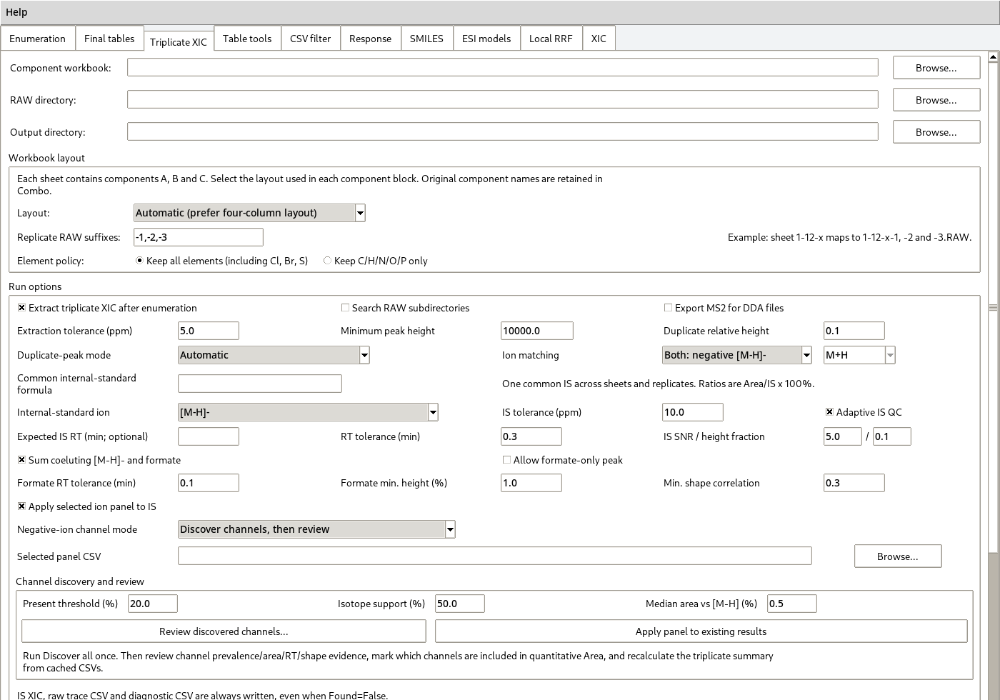
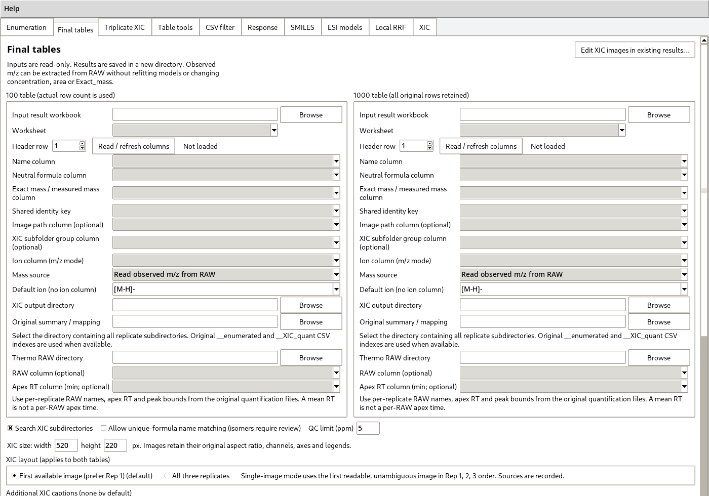

# CombiTrace-MS user guide

Version 18.48.2-en.1 · English supplementary-software edition

## 1. Scope and starting the application

CombiTrace-MS links a predefined A/B/C reaction library to extracted-ion
chromatograms (XICs), triplicate peak-area measurements, molecular structures,
and relative-response-factor (RRF) models. The application runs locally. It
reads input files and writes result files; it does not upload study data.

This edition is based on 18.48.2. Batch spectrum-report generation,
deuteration analysis and report sign-off are not part of this release. The
remaining analysis methods are retained. Later fine-resolution and
local-structure model experiments are not included.

Run `python app.py` from the extracted repository, or double-click
`START_COMBITRACE.bat` in the working Windows Python environment. The menu
**Help > User guide** opens the offline copy of this document. Installation
and Windows build instructions are in `INSTALLATION.md` and `BUILD_EXE.md`.

The ten tabs are independent entry points. For a complete study, the usual
sequence is **Triplicate XIC → SMILES → ESI models → Final tables**. Use
**Enumeration** for component CSVs, or **Triplicate XIC** for component
worksheets. Do not process the same source through both simply to obtain two
copies of an enumeration.



Scroll within long settings pages to reach the run button and log. Resizing
or scrolling the page does not change an analysis setting.

## 2. Prepare a study directory

Keep the application source separate from experimental files. A practical
layout is:

```text
study/
    components/       component formulas and mapped structures
    raw/              original Thermo RAW files
    standards/        known concentrations and standard-injection results
    unknowns/         unknown-mixture results
    outputs/          generated workbooks, CSVs and figures
```

Retain the original component identifiers, A/B/C roles, product formula and
Combo string. Local row numbers are not reliable identifiers across separately
sorted or renumbered tables. A formula match alone does not identify a
particular structural isomer.

Known-standard and unknown-mixture ratios must use the same numerical scale
and the same accepted ion-channel definition. A ratio of 0.5 and a percentage
ratio of 50 represent the same measurement but are not interchangeable as
unlabelled numerical inputs. The software does not infer a conversion factor
from the percent sign in a column name.

For separate alcohol-derived and phenol-derived series, use separate
calibration and target files. Keep descriptor definitions, processing rules
and validation settings comparable; selected features and fitted models may
differ between series. Do not use a standard's concentration as the unknown
mixture's concentration merely because the compound identity is shared.

## 3. Enumerate components and extract triplicate XICs

### Component worksheet

Open **Triplicate XIC** and select the component workbook. Supported layouts
have two, three or four columns per component role. The four-column layout is
`ID / Formula / Mass / SMILES`, repeated for A, B and C. The three-column
layout omits SMILES. The two-column layout contains formula and mass pairs.
Examples are in `templates/`; complete and check them before use. Every
selected data sheet is treated as a component set, so keep instructions and
unrelated tables in separate files.

The enumeration uses the specified reaction stoichiometry. The shipped default
combines A+B+C, removes N2 and H, and adds the net O/P core contribution.
That default is specific to the original reaction workflow. Verify it against
the chemistry of the study; a correctly executed formula calculation cannot
validate the reaction scheme.

Duplicate product formulas are retained as separate combinations with
`Duplicate_index`, `Duplicate_count` and `Combo`. They are not independent
structural identifications simply because separate rows exist.

### RAW naming and extraction

Select the RAW parent directory and output directory. The default triplicate
pattern links a group to three RAW files with suffixes `-1`, `-2` and `-3`.
For example:

```text
GroupA-1.raw
GroupA-2.raw
GroupA-3.raw
```

Check the displayed naming and suffix settings when existing filenames differ.
The source group and each replicate are retained in the output. Select the
ion mode, ppm tolerance and peak-selection settings, then enable XIC processing
and start the tab's enumeration/XIC action. Start with one small group to
confirm the RAW mapping and expected chromatograms.

The extraction tolerance defines an XIC window; it is not a measured ppm
error. `Exact_mass` is a theoretical neutral mass. Peaks that fail the active
criteria remain missing rather than being filled with a theoretical signal.

### Internal standard and ion channels

In common-internal-standard mode, enter and verify the internal standard's
formula and single-ion extraction settings. Inspect its XIC and QC output,
including the reported peak area and RT. A visible plot is not, by itself, a
passing QC result.

For negative-ion work, the channel settings offer a primary-ion route,
discovery followed by review, or an already reviewed experiment panel.
**Review discovered channels...** opens the channel table. Assign the panel
purpose explicitly: `SUM`, `REPORT`, `EVIDENCE` or `EXCLUDE`. Only accepted
channels assigned to summation contribute to the panel-summed area. Do not
sum every candidate adduct or diagnostic fragment without checking its
assignment. This channel review remains available; it is unrelated to the
removed report-signoff tab.

The action for applying a reviewed panel to existing results uses available
cached channel records. It cannot recover a channel that was never extracted.
Keep both primary-ion and summed-panel fields when comparing definitions.

### Triplicate result rules

The valid-replicate mean uses only `Found=True` records with finite values.
For ratios in common-internal-standard mode, the internal standard must also
be found, have positive area and pass its QC rules. A strict triplicate result
is filled only when all three replicates are valid. Missing values are not
counted as zero.

`Mean_Area_to_IS_Ratio_%` is the mean of valid replicate ratios, each calculated
as `target area / internal-standard area × 100`. The internal-standard row
reports the internal standard's own areas, RTs and QC; it is not an additional
calibration compound.

Preserve the enumeration CSVs, per-RAW `__XIC_quant.csv` files and
`__XIC_plots` directories. They link later table rows to their original images
and per-replicate RTs. Do not rename only the PNG files while discarding those
indices.

## 4. Construct and verify product SMILES

Open **SMILES**. Select a component workbook containing mapped component
structures and enter the mapped fixed core. Attachment labels `[*:1]`,
`[*:2]` and `[*:3]` identify the corresponding A, B and C connections.

Use **Check structures and attachment points**, then preview a representative
combination. Correct invalid valence, missing attachment labels and unmatched
components before generating the master table. The product structure is
assembled from the provided structures; it is not inferred from an exact mass
alone.

The master table stores the product SMILES, identity keys and formula checks.
Review every formula mismatch and unresolved connection. Use verified product
structures for descriptors. Salt forms, alternative tautomer notation and
locally renumbered components need explicit, consistent identity handling.

Structure fields can be omitted from a privacy-oriented result export. A
structure hash or a set of numeric descriptors is not a recoverable copy of
the full SMILES. Keep the private, verified structure master separately.

## 5. Fit and evaluate an ESI response model

### Select the modelling route

Open **ESI models**. The main action, **Generate descriptors and compare
models**, is the original multi-model RRF benchmark. This guide's selection
rules refer to that action. The retained continuous-audit and multiview
buttons open separate analysis routes with different model-selection rules;
they do not silently replace the main benchmark. Do not combine one route's
validation metrics with another route's target predictions.

Select the known-standard table, unknown table, and verified structure master.
Map the Combo, formula, ratio, concentration and RT columns. Known standards
require positive finite concentrations and ratios. The calibration input accepts
up to 100 nonempty records; 94, 98 or 99 rows are valid. The main benchmark
requires at least 20 usable calibration records, which is a software limit,
not evidence that a study is statistically adequate.

To reuse a previous descriptor export, select the workbook containing
`ESI_Features`, whether hidden or visible. A final illustrated result without
that sheet cannot replace the descriptor cache. Reuse avoids regeneration;
changing a descriptor-generation checkbox does not erase a column already
present in a cache.

### Gradient and descriptors

Enter the actual gradient table, verify solvent identities and set the
configured delay consistently. Apex composition is interpolated from the
method, not measured in the electrospray droplets. Structural descriptors
include standard RDKit functions, formula counts and explicitly defined
computed proxies. Optional 3D values depend on the calculated conformer.
Proxy labels do not certify actual pKa, anion free energy or ionization
mechanism. See `docs/METHODS.md` for definitions and limits.

Keep the same descriptor options and ratio conventions across calibration and
target sets. A missing structure or failed calculation is not repaired by
inventing a descriptor value.

### Feature selection and model comparison

The main interface initially uses five folds and three repeats, random seed 42,
a descriptor-count range of 6–40, a 50% selection-frequency threshold and
absolute correlation threshold 0.97. These are starting settings; record the
actual settings used for the reported run.

The main sequence is availability/variance/redundancy prescreening, fold-level
F-score selection against log RRF, inner comparison of descriptor counts,
selection-frequency aggregation, and a final refit with another selector.
`Selected_Descriptors` reports retained raw descriptors, not necessarily every
expanded column after the last selector. A frequency below 100% does not mean
that the final model uses the feature for only some target compounds.

The **fixed-model descriptor search** is a separate branch. Its manual
selection pool is not a universal whitelist for the main benchmark.

After running, inspect `Model_Readme`, `Model_Comparison`,
`Selected_Descriptors`, `Descriptor_Selection` and `Descriptor_Tuning`.
Some audit sheets are hidden by default and can be unhidden in Excel.
The prediction table's model/source field should agree with the validation
result being reported.

Use fold errors, strict relative-error measures where available, trend
plots and simple baselines together. Low median fold error can coexist with
poor discrimination among close concentrations. Large prediction coverage
only means that numerical predictions could be produced. Status labels do
not constitute independent analytical validation.

If automatic outlier screening is used, review the rejected records and report
the exclusion policy and post-screening nature of the results. Do not remove
records merely to obtain a better figure, or report full-fit standard
predictions as held-out predictions.

## 6. Add masses, ppm and XICs to final tables

Open **Final tables**. The two panels labelled 100 and 1000 are table roles,
not mandatory row counts. Select the original result workbook(s), data sheet,
name and formula columns. Select a common identity key only when it has the
same meaning on both sides. Otherwise use the documented automatic identity
matching; do not use local row numbers.



### Theoretical versus observed mass

Choose the appropriate mass mode:

- **Reference neutral mass** compares a calculated neutral mass with the
  formula-derived value. It is not an instrument mass-accuracy measurement.
- **Observed neutral mass** accepts a genuinely measured or independently
  derived neutral mass supplied by the user.
- **Observed m/z** compares a supplied ion m/z with the corresponding theoretical
  ion, using the selected adduct.
- **Read observed m/z from RAW** reads a centroid near the original XIC apex.
  Supply the RAW parent directory and original per-RAW RT/channel indices.

The standard m/z error is:

```text
ppm = (Observed_mz - Theoretical_mz) / Theoretical_mz × 1,000,000
```

For `[M-H]-`, compare observed and theoretical values for that ion, not the
ion m/z with neutral `Exact_mass`. An explicitly selected adduct column takes
precedence over the fallback single adduct. Confirm `Observed_adduct` in the
output.

RAW extraction uses a default ±20 ppm candidate window and a separate ±5 ppm
QC limit. It reads a same-polarity Full MS1 centroid nearest the saved apex RT;
profile-only grid points are not treated as measured centroids. Per-replicate
results and scan sources are recorded. The first valid replicate supplies the
main value by default, without selecting the replicate having the smallest
absolute ppm.

Theoretical and observed values display six decimal places. ppm is numerical,
including genuine zero; very small nonzero values use scientific notation.
Missing observations remain blank with a reason. More displayed digits do
not restore precision absent from the source measurement.

### XIC selection and captions

For each table select the parent output directory containing all sample groups,
three replicate plot directories and their CSV indices. A typical structure is:

```text
GroupA/
    GroupA__enumerated.csv
    GroupA-1__XIC_quant.csv
    GroupA-2__XIC_quant.csv
    GroupA-3__XIC_quant.csv
    GroupA-1__XIC_plots/001__GroupA_0001__mz356.11695.png
    GroupA-2__XIC_plots/001__GroupA_0001__mz356.11695.png
    GroupA-3__XIC_plots/001__GroupA_0001__mz356.11695.png
```

Select the first available plot or all three replicates. The first-plot rule
prefers replicate 1, then 2, then 3 when a source is unavailable or ambiguous.
It does not select the most attractive chromatogram. Three-plot mode preserves
replicate positions and marks unavailable/conflicting sources.

Additional captions are optional: replicate, RAW name, compound name and
custom text. Leave all caption options empty for no added header. Existing
text inside the source PNG is not removed. A clean visible caption does not
make a workbook anonymous; paths and identities remain in audit records.

Run the full-table matching check before export. Renamed final rows may require
the original triplicate summary as a mapping table. Formula conflicts,
ambiguous identities and multiple rows claiming the same source are reported
instead of being resolved by choosing the first candidate.

The export creates a new directory with workbook copies, audit CSV/JSON and a
completion marker. Review `Postprocess_Audit`, `Observed_Mass_Audit` when used,
and `postprocess_diagnostics.txt`. The main table adds `Name_in_1000` only to
the known table. No match should be interpreted as an absence of the compound
without reviewing its cause.

## 7. Change images in an existing result

In **Final tables**, open the existing-XIC editor. The same window can be
started with `python run_existing_xic_edit.py`.

Add the generated workbook(s). Keep the existing display mode and size when
only changing captions. Leave additional text unchecked to remove a header
added by the postprocessor, or select the desired fields. First check whether
the images can be edited, then replace them and save a copy.

The editor does not append another XIC column. It preserves existing masses,
ppm, concentrations, peak areas, row order and original formula caches. It
updates the selected images, image status, audit and necessary display sizes.
RAW files are not reopened. By default it uses verified image blocks already
embedded in the workbook; the original PNG directory is an optional fallback.

A single-image workbook cannot supply two never-embedded replicates unless
those source PNGs are still available. Unknown layouts, protection, identity
conflicts and unsafe image anchors are left unchanged with a diagnostic.
Original in-plot titles, coordinates, legends and traces are not erased.

## 8. Reproducible software demonstration

From the repository root run:

```bash
python examples/create_demo.py
```

The script creates a small labelled synthetic workbook and triplicate PNGs,
then runs the final-table exporter. No RAW file, network access or experimental
concentration is used. Numerical m/z offsets and chromatograms are generated
for testing and labelled as such. Results appear under
`examples/demo_output/`, which is excluded by `.gitignore`.

Check that known rows map to target names, three images occupy each requested
XIC cell, and the signed ppm values match the intentionally supplied offsets.
The demonstration is an input/output check, not validation of an ESI model.
Model and legacy-input regression checks are in `tests/`; see
`docs/TESTING.md` for commands and verified scope.

## 9. Troubleshooting and reporting

| Symptom | Action |
|---|---|
| No XIC images match | Select the parent tree, retain original CSV indices, and inspect the diagnostics before renaming files. |
| All ppm values are zero | Check whether the chosen mass is theoretical `Exact_mass`. Do not add an artificial offset. |
| Observed m/z differs by about one mass unit | Check neutral versus ion columns, adduct and charge before assuming an error. |
| No descriptor data are available | Use an ESI export containing `ESI_Features`; check whether a structure master is required. |
| A feature count differs between sheets | Separate raw retained descriptors from encoded/last-selector inputs. |
| English output is not recognized by an older external script | Update the script's header mapping using `docs/DATA_FORMATS.md`. |
| A previously illustrated workbook gains another XIC column | Use the existing-XIC editor, not the final-table append operation. |
| An EXE opens with a missing module | Inspect the build and startup logs; check the interpreter and keep the whole EXE directory. |

For a reproducible issue report include the release version, Python and relevant
package versions, entry point, selected settings and the complete error text.
Review logs before sharing: they may contain local paths or compound identities.
Use minimal synthetic examples rather than uploading confidential study files.

For publication, archive the exact source release and record the feature list,
model configuration, ratio/ion definitions, exclusions and evaluation design.
Use the actual maintainer information and chosen license in the repository.
No experimental performance, software authorship or redistribution permission
is established by completing the demonstration.
